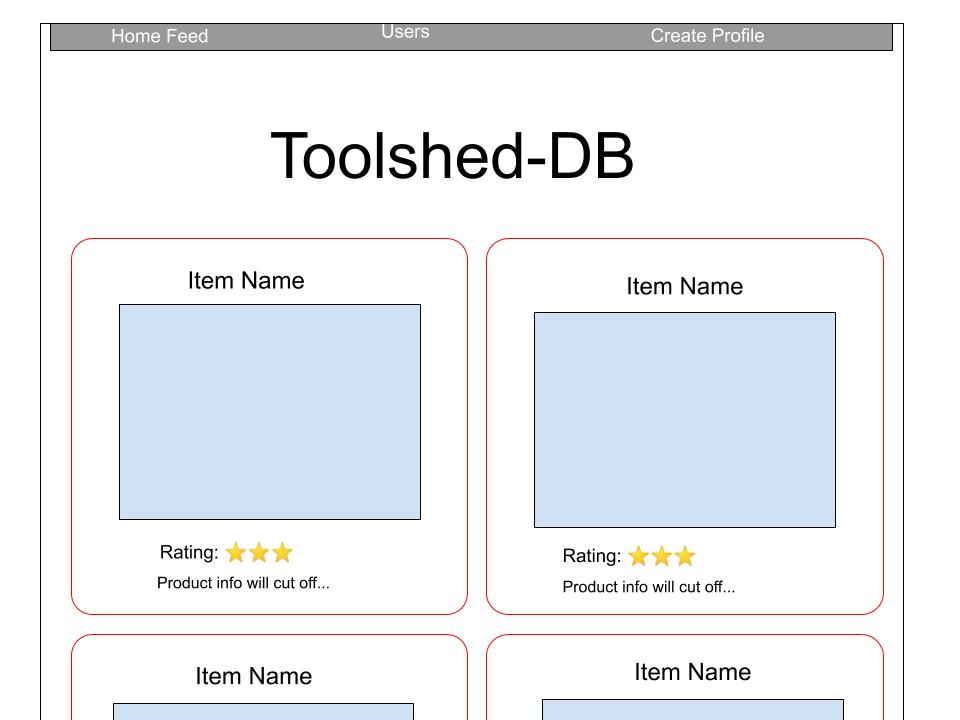
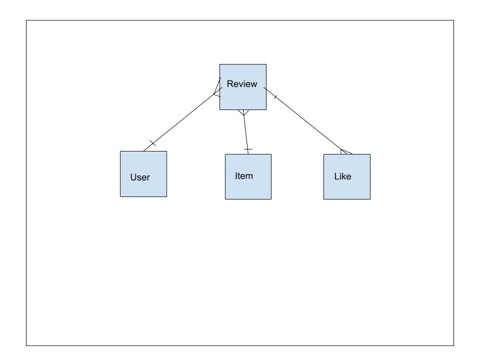

The purpose of this app is to work as a forum where different construction tools & equipment can be posted for review by forum members, from the novice DIY weekend project warrior, to the carreer professional. Guests can browse items & reviews for the sake of gaining knowledge of current products they may be considering purchasing. Guests can also create a User profile with a name, photo, and bio, which enabels them to post reviews and ratings on any of the items, as well as 'like' reviews written my other members. 

 <a href="https://toolshed-db.herokuapp.com/">Deployed web app address:</a>

GitHub address: https://github.com/Mshea424/GA-SEI-Project-4

Project planning board: https://github.com/Mshea424/GA-SEI-Project-4/projects/1

wireframes: 

ERD: 